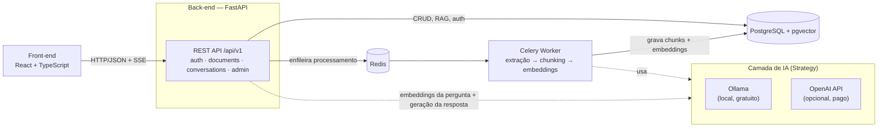
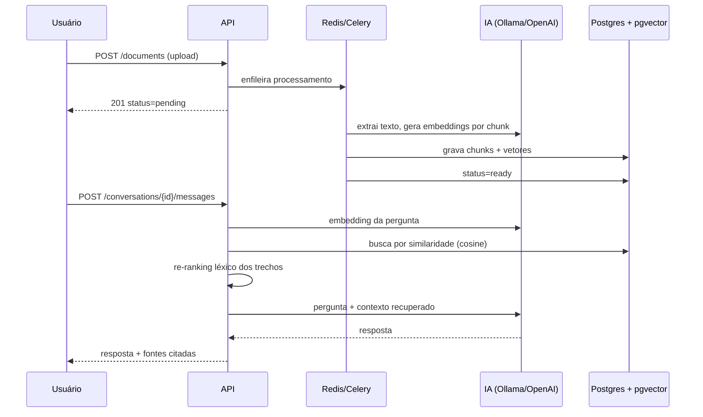
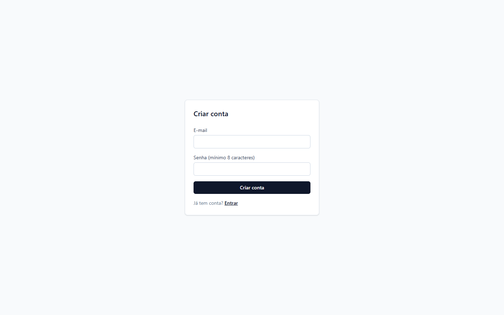
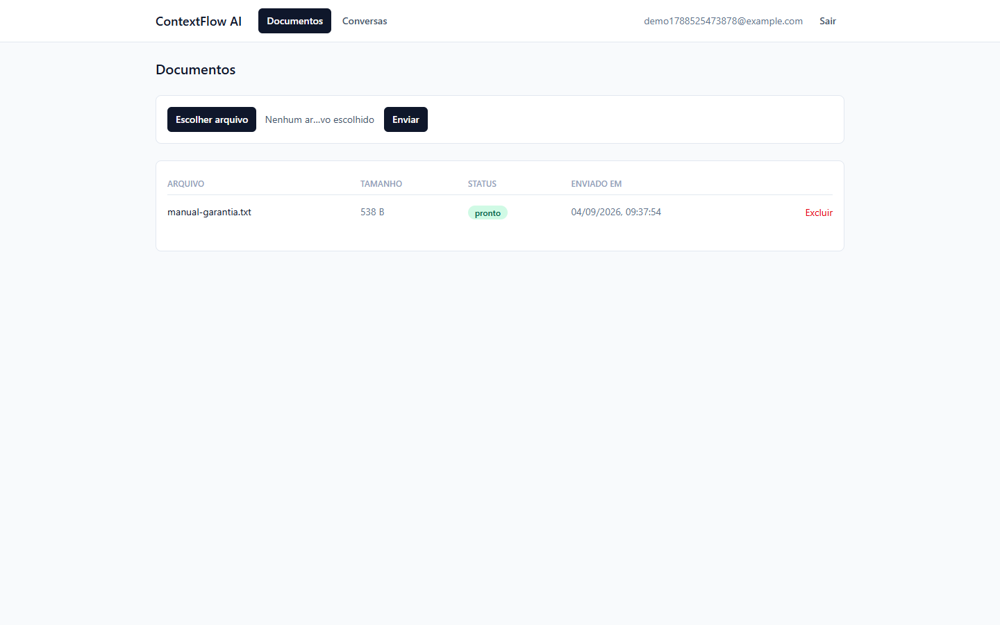
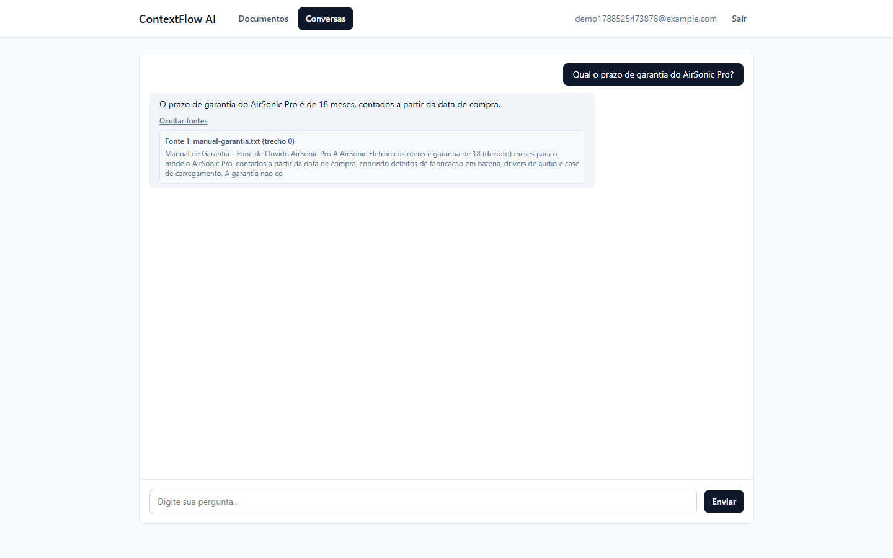

# ContextFlow AI

Plataforma de IA em Python para upload de documentos e conversas com respostas
contextualizadas via **RAG (Retrieval-Augmented Generation)**: processamento assíncrono,
busca vetorial, autenticação JWT, testes automatizados e observabilidade — pensada pra
rodar **100% de graça** localmente com [Ollama](https://ollama.com), com OpenAI como opção
configurável.

[](https://github.com/WesleyBert/contextflow-ai/actions/workflows/ci.yml)


> Acompanhe o progresso e as decisões de cada etapa em
> [`PLANO_DESENVOLVIMENTO.md`](./PLANO_DESENVOLVIMENTO.md) — o checklist vivo do projeto.

## Sobre

O usuário faz upload de documentos (`.txt`/`.pdf`), que são processados em background
(extração → chunking → embeddings) e ficam disponíveis pra conversas: cada pergunta busca
os trechos mais relevantes por similaridade vetorial, aplica um re-ranking léxico, e gera
uma resposta citando a fonte usada — sem inventar informação fora do que foi enviado.

**Principais funcionalidades**

- Autenticação com JWT (access + refresh token) e isolamento de dados por usuário
- Upload de documentos com processamento assíncrono (Celery) e status em tempo real (SSE)
- Pipeline RAG completo: chunking, embeddings, busca vetorial (pgvector) e re-ranking
- Troca de provedor de IA sem mudar código de negócio (Strategy: Ollama local ou OpenAI)
- Paginação, filtros, ordenação, idempotência e rate limiting nos endpoints principais
- Logs estruturados em JSON, métricas Prometheus e painel administrativo
- Front-end em React + TypeScript consumindo a API
- 145 testes automatizados, 97% de cobertura, CI no GitHub Actions

## Arquitetura



O código segue camadas inspiradas em Clean Architecture — `api` fala com `application`
(services/use cases), que depende só de contratos (`domain`, via `Protocol`), implementados
em `infrastructure`. Isso é o que permite trocar Ollama por OpenAI, ou o storage local por
outro, sem tocar em regra de negócio:

```
src/
├── api/            # rotas, dependências e middlewares do FastAPI
├── application/    # services e use cases (regras de aplicação)
├── domain/         # entidades, exceções e contratos de repositório (Protocol)
├── infrastructure/ # banco de dados, repositórios, IA, storage, filas
└── workers/         # tarefas assíncronas (Celery)

frontend/
└── src/
    ├── api/         # cliente HTTP + funções por recurso
    ├── components/  # componentes de UI reutilizáveis
    ├── context/     # estado de autenticação
    └── pages/       # telas (login, documentos, conversas)
```

### Pipeline RAG



## Stack

| Camada | Tecnologias |
| --- | --- |
| Back-end | Python 3.11+, FastAPI, SQLAlchemy (async), Alembic, Pydantic v2 |
| Fila assíncrona | Redis + Celery |
| IA | Ollama (local) ou OpenAI API, via camada de abstração própria (Strategy) |
| Banco vetorial | PostgreSQL + pgvector |
| Front-end | React 19, TypeScript, Vite, TanStack Query, Tailwind CSS |
| Qualidade | Pytest (+cobertura), Ruff, MyPy (strict), Vitest, oxlint, GitHub Actions |

## Como rodar

### Pré-requisitos

- Python 3.11+
- Node.js 20+
- Docker (pra Postgres com pgvector e Redis)
- [Ollama](https://ollama.com) instalado localmente (opcional — só se não for usar OpenAI)

### 1. Infraestrutura

```bash
docker compose up -d   # sobe Postgres (pgvector) e Redis
```

### 2. Back-end (API)

```bash
python -m venv .venv
.venv/Scripts/activate      # Windows — em Linux/Mac: source .venv/bin/activate
pip install -e ".[dev]"

cp .env.example .env        # ajuste se necessário

alembic upgrade head        # aplica as migrations

uvicorn src.main:app --reload   # API em http://localhost:8000 (docs em /docs)
```

### 3. Worker (processamento assíncrono)

Em outro terminal, com o mesmo venv ativado:

```bash
celery -A src.infrastructure.queue.celery_app worker --loglevel=info
```

### 4. IA — Ollama (padrão, local e gratuito)

```bash
ollama pull llama3.2:3b
ollama pull nomic-embed-text
```

Pra usar OpenAI em vez de Ollama, defina `AI_PROVIDER=openai` e `OPENAI_API_KEY` no `.env`
(veja `.env.example` pras demais variáveis — modelo, dimensão do embedding, etc.).

### 5. Front-end

Em outro terminal:

```bash
cd frontend
cp .env.example .env        # aponta pra API local por padrão
npm install
npm run dev                 # http://localhost:5173
```

> No Windows, `localhost` às vezes resolve pra `::1` (IPv6) no navegador enquanto o
> Uvicorn, por padrão, só escuta em `127.0.0.1` (IPv4) — isso derruba as chamadas do
> front pra API com "connection refused". Por isso o `.env.example` já aponta direto pra
> `127.0.0.1`; se mudar pra `localhost`, teste no seu ambiente.

## Capturas de tela

Fluxo completo, capturado ponta a ponta contra a stack real (API, worker, Postgres/pgvector
e Ollama local — nenhum dado mockado):

| Autenticação | Documento processado |
| --- | --- |
|  |  |

**Conversa com resposta via RAG, citando a fonte:**



## Endpoints da API

Documentação interativa completa (Swagger) em `/docs` com a API rodando. Resumo dos
principais endpoints, todos sob o prefixo `/api/v1` (exceto `/metrics`):

| Método | Rota | Descrição |
| --- | --- | --- |
| `POST` | `/auth/register` | Cria usuário |
| `POST` | `/auth/login` | Login, retorna access + refresh token |
| `POST` | `/auth/refresh` | Renova os tokens a partir de um refresh token válido |
| `GET` | `/auth/me` | Dados do usuário autenticado |
| `POST` | `/documents` | Upload de documento (multipart), dispara processamento assíncrono |
| `GET` | `/documents` | Lista documentos (paginação, filtro por status, busca, ordenação) |
| `GET` | `/documents/{id}` | Detalhe de um documento |
| `DELETE` | `/documents/{id}` | Remove um documento |
| `GET` | `/documents/{id}/status` | Status atual do processamento |
| `GET` | `/documents/{id}/status/stream` | Status em tempo real via SSE |
| `POST` | `/conversations` | Cria uma conversa |
| `GET` | `/conversations` | Lista conversas (paginação, busca, ordenação) |
| `GET` | `/conversations/{id}/messages` | Histórico de mensagens |
| `POST` | `/conversations/{id}/messages` | Envia uma pergunta (RAG) e recebe a resposta |
| `POST` | `/conversations/{id}/messages/{id}/feedback` | Avalia uma resposta (👍/👎) |
| `GET` | `/admin/metrics` | Métricas administrativas (restrito a `ADMIN_EMAILS`) |
| `GET` | `/health` | Health check |
| `GET` | `/metrics` | Métricas no formato Prometheus |

### Exemplos

**Registro + login**

```bash
curl -X POST http://localhost:8000/api/v1/auth/register \
  -H "Content-Type: application/json" \
  -d '{"email": "ana@example.com", "password": "senha-forte-123"}'

curl -X POST http://localhost:8000/api/v1/auth/login \
  -H "Content-Type: application/json" \
  -d '{"email": "ana@example.com", "password": "senha-forte-123"}'
```

```json
{
  "access_token": "eyJhbGciOiJIUzI1NiIs...",
  "refresh_token": "eyJhbGciOiJIUzI1NiIs...",
  "token_type": "bearer"
}
```

**Upload de documento**

```bash
curl -X POST http://localhost:8000/api/v1/documents \
  -H "Authorization: Bearer $ACCESS_TOKEN" \
  -F "file=@contrato.pdf"
```

```json
{
  "id": "3f2c9a3e-2d1b-4b8a-9d7a-1a2b3c4d5e6f",
  "filename": "contrato.pdf",
  "content_type": "application/pdf",
  "size_bytes": 48213,
  "status": "pending",
  "created_at": "2026-09-04T14:32:10.123456Z"
}
```

**Pergunta com RAG (após o documento chegar a `status=ready`)**

```bash
curl -X POST http://localhost:8000/api/v1/conversations/$CONVERSATION_ID/messages \
  -H "Authorization: Bearer $ACCESS_TOKEN" \
  -H "Content-Type: application/json" \
  -d '{"content": "Qual o prazo de vigência do contrato?"}'
```

```json
{
  "user_message": { "id": "...", "role": "user", "content": "Qual o prazo de vigência do contrato?", "sources": [], "created_at": "..." },
  "assistant_message": {
    "id": "...",
    "role": "assistant",
    "content": "O contrato tem vigência de 24 meses a partir da data de assinatura.",
    "sources": [
      {
        "document_id": "3f2c9a3e-2d1b-4b8a-9d7a-1a2b3c4d5e6f",
        "document_filename": "contrato.pdf",
        "chunk_index": 4,
        "snippet": "...vigência do presente contrato será de 24 (vinte e quatro) meses..."
      }
    ],
    "feedback": null,
    "created_at": "..."
  }
}
```

## Testes e qualidade

```bash
ruff check .                 # lint
mypy src/                    # type-check (strict)
pytest --cov=src             # 145 testes, 97% de cobertura em src/

cd frontend
npm run lint                 # oxlint
npm run test                 # vitest
npm run build                # tsc -b && vite build
```

O [pipeline de CI](.github/workflows/ci.yml) roda lint, type-check e testes (com Postgres
+Redis reais como service containers) a cada push/PR na `main`, pro back-end e pro
front-end, e mantém o badge de cobertura acima atualizado automaticamente.

## Decisões técnicas

Registro completo e cronológico em [`PLANO_DESENVOLVIMENTO.md`](./PLANO_DESENVOLVIMENTO.md#notas-de-sessão).
Alguns destaques:

- **pgvector em vez de um banco vetorial dedicado** (Pinecone, Weaviate, etc.) — evita mais
  uma peça de infra pra rodar/manter, e a busca por similaridade fica na mesma transação
  que o resto dos dados (isolamento por usuário, joins, etc.), sem sincronizar dois bancos.
- **Chunking hand-rolled em vez de LangChain** — janela de caracteres com sobreposição é
  suficiente pro escopo do projeto, e implementar na mão deixa o comportamento (e os testes)
  totalmente explícitos, sem herdar a superfície de uma lib genérica.
- **Strategy pattern pro cliente de IA** (`LLMClient`/`EmbeddingClient` como `Protocol`) —
  troca entre Ollama e OpenAI só editando `.env`, sem tocar em `RAGService` nem em nenhuma
  regra de negócio; os testes usam um fake determinístico, sem depender de rede.
- **Re-ranking léxico em vez de cross-encoder** — mistura similaridade vetorial com
  sobreposição de palavras-chave; evita carregar (e rodar) mais um modelo só pra reordenar
  poucos resultados.
- **SSE em vez de WebSocket** pro status de processamento — é uma atualização unidirecional
  (servidor → cliente) de curta duração; WebSocket adicionaria complexidade sem necessidade.
- **Modelo `llama3.2:1b` trocado por `llama3.2:3b`** — o 1b é rápido mas ignorava o contexto
  do RAG e alucinava; o 3b segue a instrução "responda só com base no contexto" de forma
  confiável, com um custo de latência aceitável rodando local.
- **`engine.dispose()` ao fim de cada task do worker** — o engine assíncrono do SQLAlchemy é
  um singleton de módulo, e cada task Celery roda seu próprio `asyncio.run()` (loop novo);
  sem descartar as conexões do pool ao final, a task seguinte quebrava tentando reusar uma
  conexão presa a um loop já fechado.
- **Tokens e custo estimados por heurística** (`len(texto) // 4`) — nem Ollama nem OpenAI
  devolvem contagem real de tokens pro `LLMClient` deste projeto; os campos no painel
  administrativo são nomeados `*_estimate` pra deixar isso explícito.

## Roadmap

- [x] Fase 0 — Fundamentos e setup
- [x] Fase 1 — API básica (auth, CRUD, integração simples com LLM)
- [x] Fase 2 — RAG completo (chunking, embeddings, pgvector, re-ranking)
- [x] Fase 3 — Processamento assíncrono (Celery, SSE, testes automatizados)
- [x] Fase 4 — Nível produção (rate limiting, paginação, idempotência, logs, métricas, admin)
- [ ] Fase 5 — Front-end: faltam a UI de feedback (👍/👎) e a tela administrativa (os
      endpoints já existem na API)
- [ ] Fase 6 — Apresentação: falta só o pipeline de CI rodando visível no GitHub (depende
      do push)

Checklist completo, com notas de cada sessão de desenvolvimento, em
[`PLANO_DESENVOLVIMENTO.md`](./PLANO_DESENVOLVIMENTO.md).
